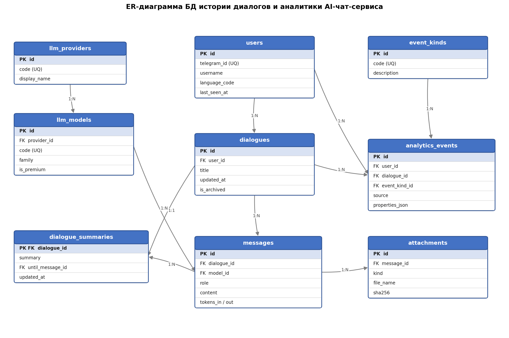

# Проект по дисциплине Базы данных

**Тема:** Проектирование базы данных истории диалогов и аналитики AI-чат-сервиса
**СУБД:** PostgreSQL 16
**Автор:** Шарманов Даниил Андреевич, ИВТ-1.1
**Преподаватель:** Жуков Николай Николаевич

## Готовый продукт

[](https://postimg.cc/gwxYmKGq)

## Вступление

Здравствуйте. Я представляю проект по проектированию базы
данных для AI-чат-сервиса.

В основе — реальный продукт, Telegram-бот с искусственным интеллектом, через
который пользователи общаются с языковыми моделями. У полного сервиса очень
большая база: биллинг, подписки, рефералы, бизнес-режим. Для курсового я
сознательно выделил из него один логически завершённый поддомен — **хранение
истории диалогов и журнал аналитики поведения пользователей**. Так проект
остаётся именно про базу данных, а не про логику бота.

```
anywai_db_cutoff/
├── er_diagram.png           ← ER-диаграмма
├── sql/                     ← схема, индексы, триггеры, функции, процедуры
└── app/                     ← CRUD REST API (FastAPI + SQLAlchemy)
```

---

## Предметная область

Пользователь авторизуется через Telegram, ведёт один или несколько диалогов,
отправляет сообщения и вложения, а сервис возвращает ответы выбранной модели.
Каждое значимое действие записывается в журнал событий.

Исходя из этого я выделил девять сущностей:

| Таблица | Назначение |
|---|---|
| `users` | пользователи сервиса |
| `llm_providers` | провайдеры моделей (Google, Anthropic, OpenAI, Groq) |
| `llm_models` | конкретные LLM-модели |
| `dialogues` | диалоги пользователя |
| `messages` | сообщения внутри диалога |
| `attachments` | метаданные вложений (без самих файлов) |
| `dialogue_summaries` | свёртки длинных диалогов |
| `event_kinds` | справочник типов событий |
| `analytics_events` | журнал событий (append-only) |

Важно: сами файлы и тексты вложений в базе не храню — только метаданные.
Биллинг и подписки вынесены за рамки, это отдельная предметная область.

---

## Выбор СУБД

Я выбрал PostgreSQL. Данные сильно связаны: пользователь — диалоги — сообщения —
вложения. Для такой структуры критичны внешние ключи и транзакции. Плюс мне нужен
гибкий тип для свойств событий — использую JSONB с индексом GIN, — и вся аналитика
опирается на оконные функции и группировки, которые есть из коробки.

| СУБД | Почему не подошла |
|---|---|
| MySQL | слабее JSON и оконные функции |
| SQLite | не для многопользовательской нагрузки |
| MongoDB | нет внешних ключей и JOIN |
| Oracle / MS SQL | платные, избыточны |

---

## Нормализация

Показываю на примере. Допустим, всю переписку храним в одной широкой таблице:

```sql
chat_log(
    message_id, telegram_id, username, first_name, language,
    dialogue_title, message_text, role,
    model_code, model_name, provider_name, is_premium,
    attachments_list, created_at
)
```

Привожу к третьей нормальной форме в три шага:

- **1НФ** — атомарность. Список вложений в одном поле `attachments_list` — это
  повторяющаяся группа, выношу вложения в отдельную таблицу.
- **2НФ** — ввожу суррогатные ключи `id`, каждый атрибут зависит от ключа целиком.
- **3НФ** — убираю транзитивную зависимость: имя провайдера зависело от модели, а
  не от сообщения. Выношу провайдеров в `llm_providers`, данные пользователя — в
  `users`.

| Поле широкой таблицы | Куда вынесено | Причина |
|---|---|---|
| username, language | users | зависит от пользователя |
| dialogue_title | dialogues | зависит от диалога |
| model_name, is_premium | llm_models | зависит от модели |
| provider_name | llm_providers | транзитивная зависимость через модель |
| attachments_list | attachments | повторяющаяся группа (1НФ) |

В итоге все девять таблиц — в третьей нормальной форме.

---

## ER-диаграмма



Связи такие: у пользователя много диалогов, в диалоге много сообщений, к сообщению
несколько вложений — цепочка один-ко-многим. У провайдера много моделей, каждая
модель сгенерировала много ответов. У диалога ровно одна свёртка — один-к-одному.
Журнал событий ссылается на пользователя, диалог и тип события.

Политики удаления:
- **CASCADE** — диалоги и сообщения удаляются вслед за пользователем;
- **RESTRICT** — нельзя удалить модель, которой уже пользовались;
- **SET NULL** — удаление пользователя не стирает историю аналитики.

---

## Физическая модель и ограничения

Самый показательный пример — таблица сообщений с проверкой бизнес-правила:

```sql
CREATE TABLE messages (
    id          BIGSERIAL    PRIMARY KEY,
    dialogue_id BIGINT       NOT NULL REFERENCES dialogues(id) ON DELETE CASCADE,
    role        VARCHAR(16)  NOT NULL,
    content     TEXT         NOT NULL,
    model_id    SMALLINT     REFERENCES llm_models(id) ON DELETE RESTRICT,
    tokens_in   INTEGER,
    tokens_out  INTEGER,
    created_at  TIMESTAMPTZ  NOT NULL DEFAULT NOW(),

    CONSTRAINT chk_messages_role_known
        CHECK (role IN ('user', 'assistant', 'system')),
    -- у ответа модели обязательно есть модель, у сообщения пользователя — нет
    CONSTRAINT chk_messages_assistant_has_model
        CHECK (
            (role = 'assistant' AND model_id IS NOT NULL)
            OR
            (role <> 'assistant' AND model_id IS NULL)
        )
);
```

Здесь видно главное: бизнес-правило «ответ модели всегда привязан к модели, а
сообщение пользователя — нет» я защищаю прямо на уровне базы, а не только в коде.

---

## Индексы

Индексы создавал под конкретные запросы:

```sql
-- список диалогов пользователя по последней активности
CREATE INDEX ix_dialogues_user_updated_at_desc
    ON dialogues (user_id, updated_at DESC);

-- только активные диалоги — частичный индекс, он меньше
CREATE INDEX ix_dialogues_active_user
    ON dialogues (user_id) WHERE NOT is_archived;

-- постраничное чтение сообщений диалога
CREATE INDEX ix_messages_dialogue_created
    ON messages (dialogue_id, created_at, id);

-- поиск событий по полю внутри JSON
CREATE INDEX gin_events_properties
    ON analytics_events USING GIN (properties_json jsonb_path_ops);
```

Что индекс реально используется, проверяю через `EXPLAIN (ANALYZE, BUFFERS)` — в
плане должен быть `Index Scan`, а не `Seq Scan`.

---

## Триггеры

Пять триггеров автоматизируют поддержку данных. Самый интересный — неизменяемость
журнала событий:

```sql
CREATE FUNCTION trg_fn_analytics_events_immutable() RETURNS TRIGGER AS $$
BEGIN
    IF TG_OP = 'DELETE' THEN
        RAISE EXCEPTION 'analytics_events is append-only: DELETE запрещён';
    END IF;
    -- при UPDATE разрешено только системное обнуление внешних ключей (SET NULL)
    IF NEW.event_kind_id IS DISTINCT FROM OLD.event_kind_id
    OR NEW.properties_json IS DISTINCT FROM OLD.properties_json
    OR (NEW.user_id IS DISTINCT FROM OLD.user_id AND NEW.user_id IS NOT NULL)
    THEN
        RAISE EXCEPTION 'analytics_events is append-only: изменение запрещено';
    END IF;
    RETURN NEW;
END;
$$ LANGUAGE plpgsql;
```

Журнал нельзя удалять и редактировать вручную, но системное обнуление ссылок при
удалении пользователя проходит. Остальные триггеры обновляют время изменения
диалога, последнюю активность пользователя и пишут событие о новом сообщении.

---

## Функции и процедуры

Пять функций считают аналитику и вызываются прямо из SQL. Например, топ моделей:

```sql
SELECT * FROM fn_top_models(NOW() - INTERVAL '30 days', NOW(), 5);

    model_code     |   display_name    | family | usage_count
-------------------+-------------------+--------+-------------
 claude-opus-4-7   | Claude Opus 4.7   | claude |           2
 claude-sonnet-4-6 | Claude Sonnet 4.6 | claude |           2
 gemini-3.5-flash  | Gemini 3.5 Flash  | gemini |           1
```

Пять процедур выполняют операции: регистрация пользователя, создание диалога,
свёртка длинного диалога, архивация, запись события. Процедура отличается от
функции тем, что вызывается через `CALL` и может управлять транзакциями.

Самая показательная — свёртка диалога: она моделирует управление контекстом
модели. Старые сообщения заменяются кратким пересказом, чтобы экономить место и
токены, и всё это происходит в одной транзакции:

```sql
CALL sp_compact_dialogue(
    p_dialogue_id => 1,
    p_summary => 'Пользователь обсуждал Python и SQL...',
    p_until_message_id => 42
);
```

---

## Оценка NoSQL

По заданию нужно оценить переход на NoSQL. Вывод: ядром остаётся реляционная база.

Документная база вроде MongoDB удобно хранила бы диалог как один документ, а Redis
подошёл бы для кэша. Но NoSQL не даёт внешних ключей и соединений, заставляет
дублировать данные пользователя в каждом документе и усложняет аналитику по
связанным сущностям. Для моей задачи это шаг назад. NoSQL оправдан только как
дополнение — кэш или отдельное хранилище для журнала при росте объёмов.

---

## CRUD и REST API

Чтобы показать работу с базой, написал REST API на FastAPI и SQLAlchemy:

| Метод и путь | Операция | Действие |
|---|---|---|
| POST /users | Create | регистрация пользователя |
| GET /dialogues?user_id= | Read | диалоги пользователя |
| PATCH /dialogues/{id} | Update | переименовать / архивировать |
| DELETE /dialogues/{id} | Delete | удалить диалог (каскадно сообщения) |
| POST /dialogues/{id}/messages | Create | добавить сообщение |
| GET /analytics/top-models | Read | топ моделей через функцию БД |

Аналитический эндпоинт не дублирует логику в коде, а вызывает функцию базы
`fn_top_models`. Всё это я проверил на реальной базе в Docker: скрипты
накатываются без ошибок, триггеры срабатывают, функции и процедуры работают,
удаление из журнала блокируется.

---

## Заключение

Я спроектировал базу данных из девяти таблиц в третьей нормальной форме,
расставил ограничения целостности, создал индексы под конкретные запросы,
реализовал триггеры, функции и процедуры, оценил целесообразность NoSQL и сделал
CRUD-приложение поверх базы. Цель проекта достигнута.
